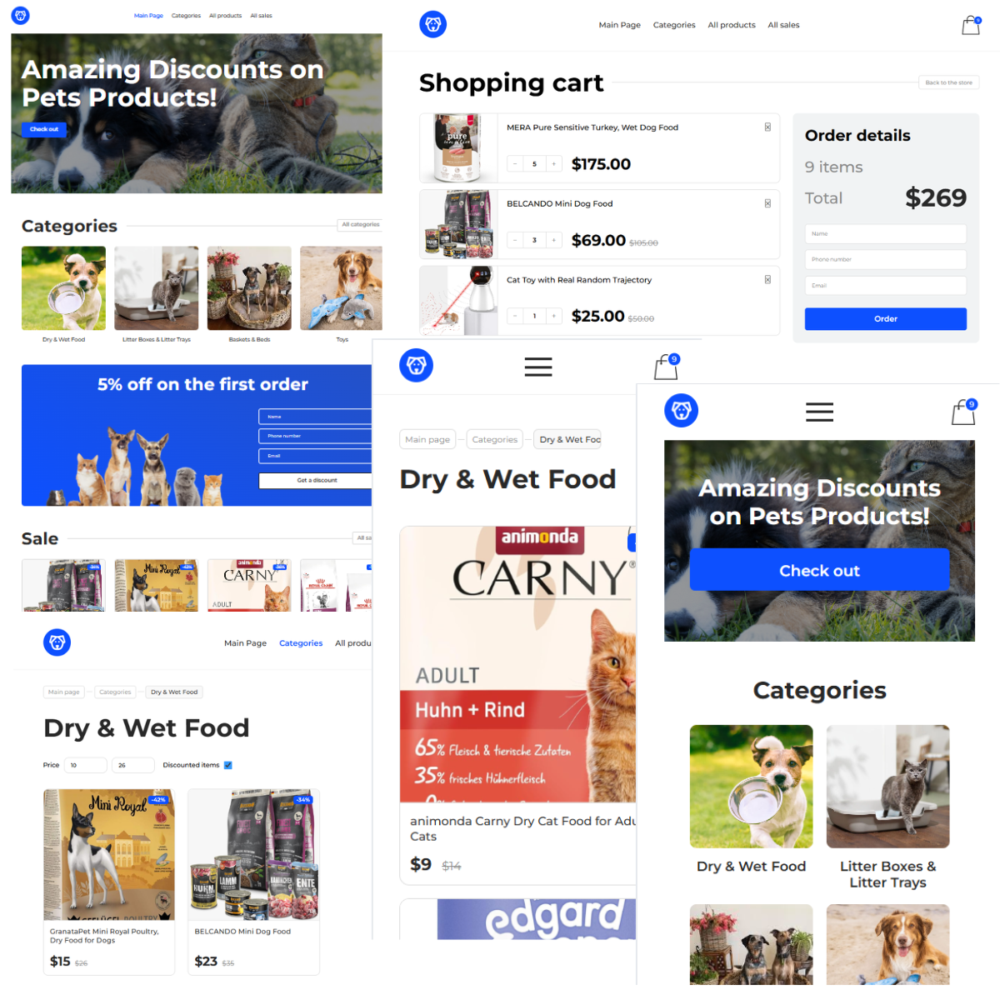

🐾 Pet Shop E-commerce Project

English | Deutsch | Русский

English 
📝 Description
A modern E-commerce frontend application for a Pet Supplies store. Built with a focus on seamless user experience, responsive design, and robust state management.

🛠 Tech Stack
Core: React 18
State Management: Redux Toolkit (Slices, AsyncThunks)
Routing: React Router Dom (v6)
API Handling: Axios
Styling: CSS Modules / SCSS, Adaptive Layout
Design: Based on Figma professional mockups

🚀 Features
Smart Catalog: Browse categories and filter items with active discounts.
Advanced Shopping Cart: Real-time calculation, item quantity management, and persistent storage.
Data Synchronization: Integrated with a backend API for dynamic product fetching.
Interactive Forms: Discount requests and order placements with built-in validation.

🎓 Lessons Learned
English
During this project, I have significantly improved my frontend development skills:
State Management: Mastered Redux Toolkit for handling complex global states, including shopping cart logic and persistent data.
Asynchronous Logic: Gained hands-on experience with Axios for fetching data from REST APIs and handling loading/error states.
Responsive Web Design: Learned how to build a fully responsive UI from Figma mockups, ensuring a seamless experience across all devices.
Component Architecture: Improved my ability to create reusable and clean React components.

Deutsch 
📝 Beschreibung
Eine moderne E-Commerce-Frontend-Anwendung für einen Shop für Haustierbedarf. Entwickelt mit Fokus auf Benutzerfreundlichkeit, responsives Design und robustes State-Management.

🛠 Technologien
Basis: React 18
State-Management: Redux Toolkit
Routing: React Router Dom
API-Anbindung: Axios
Styling: CSS Modules, Adaptives Design
Design: Basierend auf Figma-Vorlagen

🚀 Hauptfunktionen
Intelligenter Katalog: Durchsuchen von Kategorien und Filtern nach reduzierten Artikeln.
Warenkorb: Echtzeit-Berechnung und Verwaltung der Artikelmenge.
API-Integration: Dynamisches Laden von Produkten über eine REST-API.
Validierte Formulare: Gutscheinbestellung und Checkout-Prozess mit Datenvalidierung.

🎓 Lernziele und Erfolge
Während der Arbeit an diesem Projekt habe ich meine technischen Fähigkeiten im Frontend-Bereich deutlich erweitert:
State-Management: Ich habe den sicheren Umgang mit Redux Toolkit gelernt, um komplexe globale Zustände zu verwalten (insbesondere die Warenkorb-Logik und die Datenpersistenz).
Asynchrone Programmierung: Ich habe praktische Erfahrungen mit Axios gesammelt, um Daten von REST-APIs abzurufen und Lade- sowie Fehlermustern professionell zu handhaben.
Responsive Webdesign: Ich habe gelernt, ein vollständig responsives UI basierend auf Figma-Vorlagen zu erstellen, das auf allen Endgeräten (Desktop, Tablet, Mobile) eine optimale Benutzererfahrung bietet.
Komponenten-Architektur: Ich habe meine Fähigkeiten in der Erstellung von sauberen, wiederverwendbaren und skalierbaren React-Komponenten verbessert.

Русский 
📝 Описание проекта
Современное Frontend-приложение интернет-магазина товаров для животных. Проект реализован с акцентом на удобство пользователя (UX), адаптивность и надежное управление состоянием данных.

🛠 Технологический стек
Ядро: React 18
Состояние: Redux Toolkit
Навигация: React Router Dom
Запросы: Axios
Стили: CSS Modules / SCSS, Адаптивная верстка
Макет: Соответствие профессиональному дизайну в Figma

🚀 Функционал
Умный каталог: Просмотр по категориям и фильтрация товаров со скидками.
Продвинутая корзина: Синхронный расчет стоимости, управление количеством и сохранение данных.
Интеграция с Backend: Динамическая подгрузка товаров и категорий через API.
Валидация форм: Обработка заявок на скидку и заказов с проверкой вводимых данных.

🎓  Чему я научилась
В ходе работы над этим проектом я значительно расширила свои технические навыки:
Управление состоянием: Глубоко освоила Redux Toolkit для работы со сложными глобальными состояниями (логика корзины, хранение данных).
Асинхронные запросы: Прокачала навыки работы с Axios для взаимодействия с REST API и обработки состояний загрузки.
Адаптивная верстка: Научилась создавать полностью адаптивный UI по макетам Figma, который корректно работает на любых устройствах.
Архитектура компонентов: Улучшила навыки проектирования чистых и переиспользуемых React-компонентов.